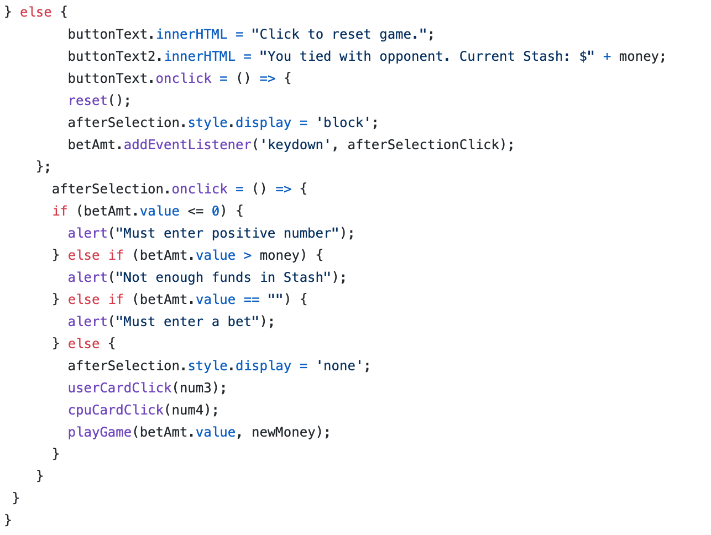

# Project
Game uses an HTML, CSS, and JavaScript file and gives user an imaginary amount of money ($100) and directs user to place Bet. Card is randomly selected from a range of 52, and there is a simple if, else if, else function that changes the .src of the UserCard div, as well as the CpuCard div, to match the appropriate card number. Face Cards count as 10, Aces count as 20, the rest of the cards count for themselves.

# Card Selection
The Cpu Card Selection works the exact same. One of the potential problems in the game is that the user and cpu could potentially draw the same card. I imagine that this could be changed using a temporary .pop function of some sort, but for now, the cpu and the user are drawing from two different decks. Also, the JavaScript file is 607 lines long, and perhaps there is a way to refractor it to be more concise. I'm not really sure.

# playGame()
The actual function that makes the game work. First, it checks if the bet is less than or equal to 0. If it is, the innerHTML changes for the buttonText and buttonText2 areas to "Click to reset game", and "Must enter positive number. Current stash: $" + money, respectively. If the buttonText area is clicked, a reset() function is called. A similiar check is done if the bet is more than the money that the user currently has in the "Stash". Then, the function does a simple check to determine if the userPoints are higher than the cpuPoints. If so, newMoney = parseInt(money) + parseInt(bet). The amount of money the user won on the previous turn is posted, along with an option to bet again. If cpuPoints are higher than userPoints, newMoney = parseInt(money) - parseInt(bet). Afterwards, if newMoney === 0, buttonText2 changes to "You lost $" + bet + '.' + ' Current Stash: $' + newMoney + " You have no more money. Click to reload $100." Then if buttonText is clicked, location.reload() is called. Lastly, an else statement wraps up the functions and alerts the user that there has been a tie, posts the Current Stash, and gives an option to bet again.

# CSS
The CSS is pretty simple. It adds cursor: pointer to the buttonText and the afterSelection divisions, sets margins for the tables class, the id tables 2, as well as the button and afterSelection divisions. It also sets a background image, and sets colors, etc. Lastly, it hides the spinner wigits and sets their -webkit-appearance to none. I.E, it hides the two arrows in the Enter Bet Amount: input. There was a problem where the user could enter characters, and it allowed user to bet more than was currently in the Stash. After awhile, I finally figured out that I could just simply change the input type to "number". Then, I didn't like the little arrows in the input box, so I set the -webkit-appearance to none.

